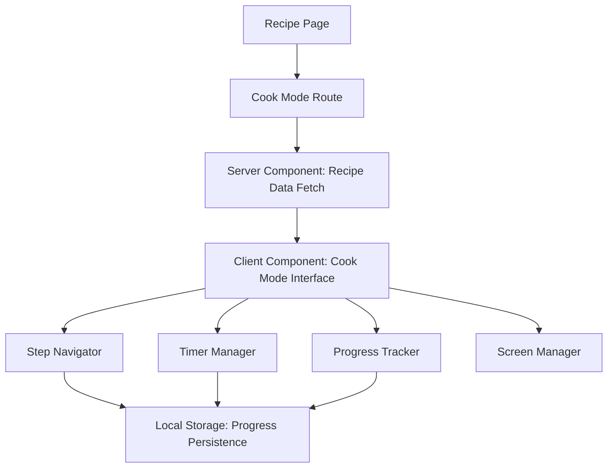
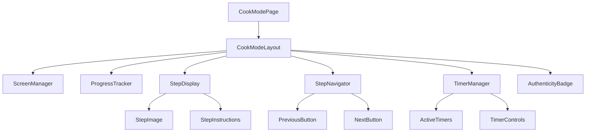

# Design Document: Cook Mode

## Overview

The Cook Mode feature transforms the standard recipe viewing experience into a dedicated, kitchen-optimized interface accessible via `/recipes/[slug]/cook`. This design prioritizes usability in real cooking environments where users have messy hands, varying lighting conditions, and need distraction-free step-by-step guidance.

The design leverages Next.js App Router for optimal performance, implements progressive enhancement for advanced features like screen wake locks, and maintains full accessibility compliance while providing an intuitive cooking experience.

## Architecture

### Route Structure

```
/recipes/[slug]/cook/
├── page.tsx          # Main Cook Mode page component
├── layout.tsx        # Cook Mode specific layout (fullscreen)
└── components/
    ├── StepNavigator.tsx
    ├── ProgressTracker.tsx
    ├── TimerManager.tsx
    ├── ScreenManager.tsx
    └── AuthenticityBadge.tsx
```

### Data Flow Architecture



### Component Hierarchy



## Components and Interfaces

### Core Data Interfaces

```typescript
interface CookModeState {
  currentStep: number;
  totalSteps: number;
  activeTimers: Timer[];
  isScreenLocked: boolean;
  progress: CookingProgress;
}

interface Timer {
  id: string;
  stepId: number;
  duration: number;
  remaining: number;
  isActive: boolean;
  isPaused: boolean;
}

interface CookingProgress {
  recipeSlug: string;
  currentStep: number;
  completedSteps: number[];
  startedAt: Date;
  lastUpdated: Date;
}

interface RecipeStep {
  id: number;
  instruction: string;
  image?: string;
  timing?: {
    duration: number;
    unit: 'minutes' | 'seconds' | 'hours';
    description: string;
  };
  tips?: string[];
}
```

### StepNavigator Component

**Purpose**: Manages step-by-step progression through cooking instructions
**Key Features**:
- Large, touch-friendly navigation buttons (minimum 44px)
- Keyboard navigation support (arrow keys, Enter, Space)
- Disabled state handling for first/last steps
- Voice command integration (progressive enhancement)

```typescript
interface StepNavigatorProps {
  currentStep: number;
  totalSteps: number;
  onNext: () => void;
  onPrevious: () => void;
  onFinish: () => void;
  disabled?: boolean;
}
```

### ProgressTracker Component

**Purpose**: Visual progress indication and direct step navigation
**Key Features**:
- Compact progress bar with step indicators
- Expandable step overview for direct navigation
- Visual distinction between completed, current, and upcoming steps
- Accessible progress announcements

```typescript
interface ProgressTrackerProps {
  currentStep: number;
  totalSteps: number;
  completedSteps: number[];
  onStepSelect: (step: number) => void;
  steps: RecipeStep[];
}
```

### TimerManager Component

**Purpose**: Integrated cooking timers with multi-timer support
**Key Features**:
- Visual countdown displays
- Audio and visual completion alerts
- Pause/resume/reset functionality
- Background timer persistence
- Multiple simultaneous timers

```typescript
interface TimerManagerProps {
  stepTimers: Timer[];
  onTimerStart: (stepId: number, duration: number) => void;
  onTimerPause: (timerId: string) => void;
  onTimerReset: (timerId: string) => void;
  onTimerComplete: (timerId: string) => void;
}
```

### ScreenManager Component

**Purpose**: Screen wake lock management and fullscreen optimization
**Key Features**:
- Screen Wake Lock API integration
- Graceful degradation for unsupported browsers
- Battery level awareness
- Automatic lock release on exit

```typescript
interface ScreenManagerProps {
  isActive: boolean;
  onWakeLockChange: (isLocked: boolean) => void;
}
```

## Data Models

### Recipe Data Reuse

The Cook Mode leverages existing recipe data structures without modification, ensuring consistency with the main recipe system:

```typescript
// Existing recipe interface (reused)
interface Recipe {
  slug: string;
  title: string;
  description: string;
  steps: RecipeStep[];
  authenticity: {
    isAIGenerated: boolean;
    culturalOrigin: string;
    region: string;
    verificationStatus: 'verified' | 'community' | 'ai-generated';
  };
  metadata: {
    prepTime: number;
    cookTime: number;
    servings: number;
    difficulty: 'easy' | 'medium' | 'hard';
  };
}
```

### Local Storage Schema

```typescript
interface CookModeStorage {
  version: string;
  recipes: {
    [slug: string]: CookingProgress;
  };
  preferences: {
    autoAdvanceTimers: boolean;
    voiceEnabled: boolean;
    screenWakeEnabled: boolean;
  };
}
```

## Correctness Properties

*A property is a characteristic or behavior that should hold true across all valid executions of a system—essentially, a formal statement about what the system should do. Properties serve as the bridge between human-readable specifications and machine-verifiable correctness guarantees.*

Let me analyze the acceptance criteria to determine which ones can be tested as properties:

### Property 1: Cook Mode Route Navigation
*For any* valid recipe slug, navigating to `/recipes/[slug]/cook` should display the Cook Mode interface with the correct recipe data, and invalid slugs should redirect to the standard recipe page with an error message.
**Validates: Requirements 1.1, 1.2, 1.3, 1.5**

### Property 2: Step Navigation Consistency
*For any* recipe with multiple steps, advancing through steps should maintain correct step order, allow regression to previous steps, and support direct navigation to any valid step number.
**Validates: Requirements 3.2, 3.3, 4.3**

### Property 3: Progress Tracking Accuracy
*For any* cooking session, the progress tracker should accurately display current step position, total steps, and completion status, with visual indicators correctly reflecting step states.
**Validates: Requirements 4.1, 4.4**

### Property 4: Timer State Management
*For any* recipe step with timing information, timers should count down accurately, maintain state during navigation, support pause/resume/reset operations, and trigger appropriate alerts on completion.
**Validates: Requirements 5.1, 5.2, 5.3, 5.4, 5.6**

### Property 5: Multi-Timer Coordination
*For any* cooking session with multiple active timers, all timers should be displayed clearly, operate independently, and maintain their individual states without interference.
**Validates: Requirements 5.5**

### Property 6: Image Display and Fallbacks
*For any* recipe step, images should display when available, show loading states during fetch, and gracefully handle failures without breaking the layout or blocking navigation.
**Validates: Requirements 6.1, 6.2, 6.3, 6.5**

### Property 7: Screen Wake Lock Management
*For any* Cook Mode session, the screen wake lock should be requested on entry, released on exit, and handle API unavailability or failures gracefully without disrupting the cooking experience.
**Validates: Requirements 7.1, 7.2, 7.3, 7.4**

### Property 8: Accessibility Compliance
*For any* Cook Mode interface element, keyboard navigation should work correctly, ARIA labels should be present, screen reader announcements should occur on state changes, and color contrast should meet WCAG standards.
**Validates: Requirements 8.1, 8.2, 8.3, 8.4, 8.6**

### Property 9: State Persistence Round-Trip
*For any* cooking session, progress and timer states should be saved to localStorage on changes, restored on return visits, and cleared on completion, with graceful degradation when localStorage is unavailable.
**Validates: Requirements 9.1, 9.2, 9.3, 9.4, 9.5**

### Property 10: Authenticity Information Display
*For any* recipe, authenticity badges should display appropriately based on recipe metadata (AI-generated indicators, cultural origin labels), remain subtle and non-intrusive, and handle missing data gracefully.
**Validates: Requirements 10.1, 10.2, 10.3, 10.4, 10.5**

### Property 11: Exit Flow Management
*For any* Cook Mode session, exit controls should be clearly visible, confirmation dialogs should appear when active timers exist, and exit should properly navigate to the standard recipe page while cleaning up resources.
**Validates: Requirements 11.1, 11.2, 11.3**

### Property 12: Performance and Reliability
*For any* Cook Mode session, essential content should load before images, navigation should remain responsive during slow network conditions, and basic functionality should work even with JavaScript failures.
**Validates: Requirements 12.1, 12.2, 12.3, 12.5**

## Error Handling

### Network and Data Errors
- **Invalid Recipe Slugs**: Redirect to standard recipe page with user-friendly error message
- **Network Failures**: Cache essential recipe data for offline functionality
- **Image Loading Failures**: Hide image containers gracefully without layout shifts
- **API Unavailability**: Graceful degradation for Wake Lock and Voice APIs

### User Input Errors
- **Invalid Step Navigation**: Prevent navigation beyond valid step range
- **Timer Conflicts**: Handle multiple timer operations without state corruption
- **Storage Failures**: Continue operation without persistence when localStorage unavailable

### Progressive Enhancement Failures
- **JavaScript Disabled**: Provide basic step navigation with server-side rendering
- **Wake Lock Unsupported**: Continue normal operation without screen management
- **Voice API Unavailable**: Hide voice controls and rely on touch/keyboard input

## Testing Strategy

### Dual Testing Approach

The Cook Mode feature requires both unit testing and property-based testing to ensure comprehensive coverage:

**Unit Tests** focus on:
- Specific user interactions (button clicks, keyboard events)
- Edge cases (first step, last step, no timers)
- Integration points between components
- Error conditions and fallback behaviors
- Accessibility compliance verification

**Property-Based Tests** focus on:
- Universal behaviors across all recipes and steps
- State management consistency during navigation
- Timer coordination across multiple simultaneous timers
- Data persistence and restoration reliability
- Performance characteristics under varying conditions

### Property-Based Testing Configuration

- **Testing Library**: Fast-check for TypeScript/JavaScript property-based testing
- **Test Iterations**: Minimum 100 iterations per property test
- **Test Tagging**: Each property test tagged with format: **Feature: cook-mode, Property {number}: {property_text}**
- **Generator Strategy**: Smart generators that create realistic recipe data, step sequences, and user interaction patterns

### Testing Implementation Requirements

Each correctness property must be implemented as a single property-based test that:
1. Generates appropriate test data (recipes, steps, user actions)
2. Executes the system behavior being tested
3. Verifies the expected property holds true
4. References the specific design document property it validates

Unit tests complement property tests by:
1. Testing specific examples that demonstrate correct behavior
2. Verifying integration between Cook Mode and existing recipe system
3. Validating accessibility features with assistive technology simulation
4. Testing error conditions that are difficult to generate randomly

### Performance Testing Considerations

- **Render Performance**: Measure component re-render frequency during navigation
- **Memory Usage**: Monitor timer state management and cleanup
- **Network Efficiency**: Test image loading prioritization and caching
- **Battery Impact**: Verify wake lock usage doesn't drain battery excessively

## Implementation Notes

### Next.js App Router Integration

- **Server Components**: Recipe data fetching and initial page rendering
- **Client Components**: Interactive Cook Mode interface with state management
- **Route Handlers**: API endpoints for progress persistence and timer synchronization
- **Metadata**: SEO-optimized metadata for Cook Mode pages

### Tailwind CSS Design System

- **Fullscreen Layout**: `h-screen w-screen fixed inset-0` for immersive experience
- **High Contrast**: Custom color palette optimized for kitchen lighting conditions
- **Touch Targets**: Minimum `h-11 w-11` (44px) for all interactive elements
- **Typography**: Large, readable fonts with `text-lg` or larger for instructions
- **Dark Mode**: Automatic adaptation based on system preferences

### Progressive Enhancement Strategy

1. **Base Experience**: Server-rendered step navigation works without JavaScript
2. **Enhanced Experience**: Client-side state management and timers
3. **Advanced Features**: Wake Lock API, Voice Commands, Haptic Feedback
4. **Accessibility Layer**: Screen reader support and keyboard navigation throughout

### Browser Compatibility

- **Core Features**: Support for all modern browsers (Chrome 90+, Firefox 88+, Safari 14+)
- **Wake Lock API**: Chrome 84+, Edge 84+ (graceful degradation for others)
- **Voice Commands**: Chrome 25+, Firefox 44+ (progressive enhancement)
- **Local Storage**: Universal support with fallback for disabled storage