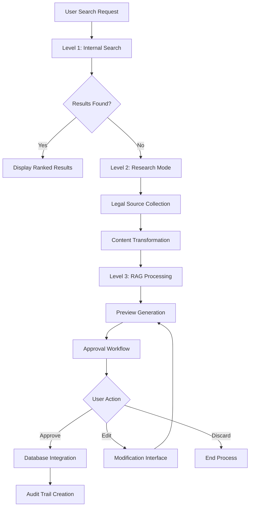
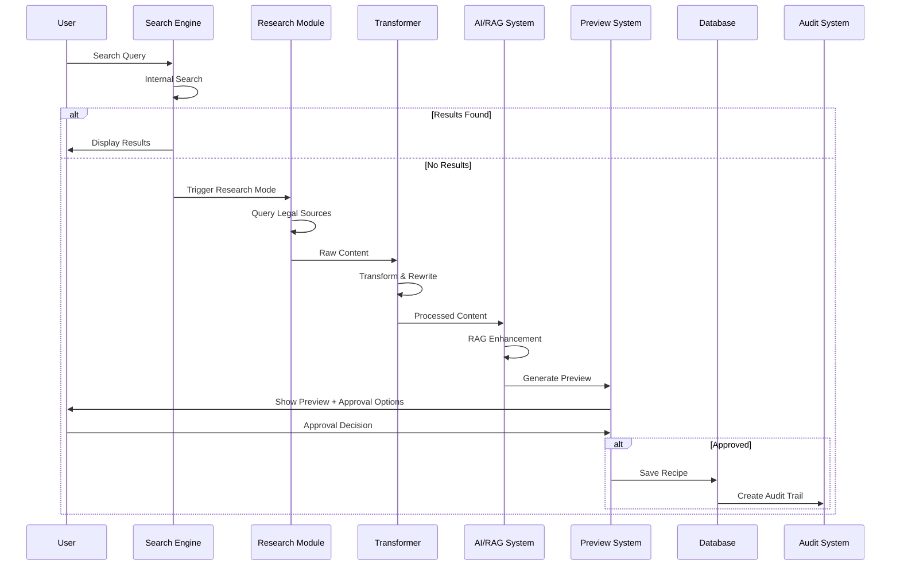

# Design Document

## Overview

The Intelligent Recipe Research System implements a production-ready, legally compliant platform for discovering authentic recipes through a sophisticated 3-level search architecture. The system prioritizes verified internal content, conducts ethical research from legal sources, and maintains strict compliance through mandatory approval workflows.

The architecture emphasizes legal safety by leveraging the fact that recipe ingredients and basic cooking methods are not copyrightable (considered factual information), while ensuring all creative expressions, descriptions, and presentations are original or properly attributed.

## Architecture

### System Architecture



### Data Flow Architecture



## Components and Interfaces

### 1. Multi-Level Search Engine

**Internal Search Component**
- **Purpose**: Primary search against existing verified recipes
- **Interface**: `InternalSearchEngine`
- **Methods**:
  - `searchRecipes(query: SearchQuery): Promise<SearchResult[]>`
  - `suggestAutoComplete(partial: string): Promise<Suggestion[]>`
  - `rankResults(results: Recipe[], query: SearchQuery): Recipe[]`

**Search Query Structure**:
```typescript
interface SearchQuery {
  text: string;
  filters: {
    cuisine?: string[];
    country?: string[];
    ingredients?: string[];
    festivals?: string[];
  };
  fuzzyTolerance: number;
  maxResults: number;
}
```

### 2. Research Mode System

**Legal Source Manager**
- **Purpose**: Coordinate research from approved legal sources
- **Interface**: `LegalSourceManager`
- **Approved Sources**:
  - Wikipedia API for cultural/historical information
  - Open Recipe APIs with Creative Commons licensing
  - Public domain recipe collections
  - Government nutrition databases

**Source Validation**:
```typescript
interface LegalSource {
  id: string;
  name: string;
  baseUrl: string;
  licenseType: 'public-domain' | 'creative-commons' | 'open-api';
  attribution: string;
  rateLimit: number;
}
```

### 3. Content Transformation Engine

**Purpose**: Transform researched content into original expressions while preserving factual accuracy

**Transformation Rules**:
- Ingredients: Rewrite measurements and descriptions in original wording
- Instructions: Rephrase cooking steps while maintaining accuracy
- Cultural context: Summarize historical information without direct quotation
- Attribution: Store source metadata without copying protected text

**Interface**: `ContentTransformer`
```typescript
interface TransformationResult {
  originalIngredients: string[];
  transformedIngredients: Ingredient[];
  originalSteps: string[];
  transformedSteps: CookingStep[];
  culturalSummary: string;
  sourceMetadata: SourceAttribution[];
}
```

### 4. RAG (Retrieval-Augmented Generation) System

**Purpose**: Enhance recipe information using verified database content and prevent AI hallucinations

**Retrieval Strategy**:
1. Primary: Query verified recipes for similar dishes
2. Secondary: Query community-reviewed recipes
3. Tertiary: Use cultural knowledge from verified sources

**Interface**: `RAGProcessor`
```typescript
interface RAGEnhancement {
  culturalContext: string;
  authenticity: AuthenticityScore;
  relatedRecipes: Recipe[];
  nutritionalInfo: NutritionData;
  servingVariations: ServingInfo[];
}
```

### 5. Preview and Approval System

**Preview Interface Components**:
- Recipe display with auto-research badge
- Cultural origin information with map integration
- Source attribution (metadata only)
- Approval action buttons
- Edit interface for modifications

**Approval Workflow States**:
```typescript
enum ApprovalStatus {
  PENDING_REVIEW = 'pending_review',
  APPROVED = 'approved',
  REJECTED = 'rejected',
  NEEDS_EDITING = 'needs_editing'
}
```

## Data Models

### Enhanced Recipe Model

```typescript
interface Recipe {
  id: string;
  name: string;
  description: string;
  ingredients: Ingredient[];
  cookingSteps: CookingStep[];
  culturalOrigin: GeographicOrigin;
  verificationStatus: VerificationStatus;
  researchMetadata?: ResearchMetadata;
  imageMetadata: ImageMetadata;
  createdAt: Date;
  updatedAt: Date;
}

interface ResearchMetadata {
  isAutoResearched: boolean;
  sources: SourceAttribution[];
  transformationLog: TransformationEntry[];
  approvalHistory: ApprovalEntry[];
}

interface SourceAttribution {
  sourceId: string;
  sourceName: string;
  licenseType: string;
  accessedAt: Date;
  contentType: 'ingredients' | 'steps' | 'cultural' | 'nutritional';
}
```

### Geographic Integration Model

```typescript
interface GeographicOrigin {
  country: string;
  region?: string;
  coordinates: {
    latitude: number;
    longitude: number;
  };
  culturalSignificance: string;
  authenticityLevel: 'verified' | 'community' | 'researched';
}
```

### User Role and Permission Model

```typescript
interface UserRole {
  id: string;
  name: 'guest' | 'contributor' | 'moderator' | 'admin';
  permissions: Permission[];
}

interface Permission {
  resource: string;
  actions: ('read' | 'write' | 'approve' | 'delete')[];
}
```

## Correctness Properties

*A property is a characteristic or behavior that should hold true across all valid executions of a system—essentially, a formal statement about what the system should do. Properties serve as the bridge between human-readable specifications and machine-verifiable correctness guarantees.*

### Property 1: Search Workflow Integrity
*For any* search query, the system should first execute internal search, and only trigger research mode when no internal results are found, ensuring proper search hierarchy
**Validates: Requirements 1.1, 1.3**

### Property 2: Search Result Ranking Consistency  
*For any* search results containing recipes with different verification statuses, verified recipes should always rank higher than community-reviewed recipes in the result ordering
**Validates: Requirements 1.2, 2.4**

### Property 3: Multi-Field Search Coverage
*For any* search query, the system should search across all specified fields (recipe names, ingredients, cuisines, countries, regions, festivals) and return matches from any relevant field
**Validates: Requirements 2.1**

### Property 4: Fuzzy Matching Tolerance
*For any* search term with common misspellings, the system should return relevant results that match the intended term, demonstrating fuzzy matching capability
**Validates: Requirements 2.2**

### Property 5: Auto-Suggest Responsiveness
*For any* partial search input, the system should generate relevant auto-suggest dropdown results in real-time
**Validates: Requirements 2.3**

### Property 6: Relevance Score Calculation
*For any* search results with multiple matching criteria, the ranking should properly combine verification status and match quality into a coherent relevance score
**Validates: Requirements 2.5**

### Property 7: Legal Source Restriction
*For any* research mode activation, the system should only query approved legal sources and explicitly block access to copyrighted sources
**Validates: Requirements 3.1, 3.2, 3.3, 3.4**

### Property 8: Source Access Audit Trail
*For any* research operation, all source access attempts should be recorded in audit logs with proper metadata
**Validates: Requirements 3.5**

### Property 9: Content Transformation Compliance
*For any* researched recipe content, the transformed ingredients and steps should differ from source material while preserving factual accuracy, and cultural summaries should contain no direct quotations
**Validates: Requirements 4.1, 4.2, 4.3**

### Property 10: Auto-Research Status Assignment
*For any* content processed through research mode, it should be marked with "Auto-researched – Pending Review" status and generate appropriate changelog entries
**Validates: Requirements 4.4, 4.5**

### Property 11: RAG Retrieval Priority
*For any* RAG system query, verified recipes should be retrieved first, with community recipes used only as secondary sources when verified content is insufficient
**Validates: Requirements 5.1, 5.2**

### Property 12: AI Response Grounding
*For any* AI-generated response, it should reference retrieved data to prevent hallucinations and clearly distinguish between retrieved facts and AI-generated explanations
**Validates: Requirements 5.3, 5.5**

### Property 13: Authenticity Source Validation
*For any* regional authenticity explanation, it should reference specific database entries and verified sources rather than unsupported claims
**Validates: Requirements 5.4**

### Property 14: Research Mode UI Indicators
*For any* active research mode operation, the system should display clear research indicators to users
**Validates: Requirements 1.4**

### Property 15: Preview Content Completeness
*For any* completed research operation, the preview should include all required elements: recipe name, ingredients, cooking steps, cultural origin, cuisine associations, and festival connections
**Validates: Requirements 6.1, 6.2**

### Property 16: Preview UI Compliance
*For any* research preview display, it should show auto-research badges, disclaimer text, and provide all required action buttons ("Edit before saving", "Add to website", "Discard")
**Validates: Requirements 6.3, 6.4**

### Property 17: Approval Status Assignment
*For any* user approval of researched content, the recipe should be saved with ai_pending verification status
**Validates: Requirements 6.5**

### Property 18: Database Relationship Integrity
*For any* approved recipe, it should be saved with proper foreign key relationships across all related tables (cooking_steps, recipe_ingredients, geographic_coordinates) and generate complete audit trails
**Validates: Requirements 7.1, 7.2, 7.3, 7.4, 7.5**

### Property 19: Image Legal Compliance
*For any* recipe image processing, copyrighted images should not be permanently hotlinked, and all image storage should include proper source metadata and attribution
**Validates: Requirements 8.1, 8.3, 8.5**

### Property 20: Image Source Support
*For any* image requirement, the system should support user-uploaded images, AI-generated illustrations, and public domain images with replacement capability during verification
**Validates: Requirements 8.2, 8.4**

### Property 21: Geographic Coordinate Precision
*For any* recipe location display, coordinates should represent cultural origin regions rather than precise addresses
**Validates: Requirements 9.1**

### Property 22: Map Display Functionality
*For any* map page access, it should display world view with recipe distribution, and country filtering should show appropriate recipe collections with map highlighting
**Validates: Requirements 9.2, 9.3, 9.4**

### Property 23: API Key Security
*For any* Google Maps integration, API keys should be loaded from environment variables without hardcoding
**Validates: Requirements 9.5**

### Property 24: Role-Based Access Control
*For any* user interaction, the system should enforce appropriate permissions based on user role (guest: browse only, contributor: submit/edit drafts, moderator: review/approve, admin: verify/publish)
**Validates: Requirements 10.1, 10.2, 10.3, 10.4**

### Property 25: User Action Accountability
*For any* user action affecting recipes, it should be tracked in recipe_verification_history for accountability
**Validates: Requirements 10.5**

### Property 26: Performance Optimization Implementation
*For any* recipe page serving, it should use ISR, implement search result caching, and use lazy loading for images and maps
**Validates: Requirements 11.1, 11.2, 11.3**

### Property 27: SEO Structured Data
*For any* indexed page, it should include proper structured data for Recipe and Place schemas, while unverified content should have noindex meta tags
**Validates: Requirements 11.4, 11.5**

### Property 28: Authenticity Badge Display
*For any* recipe display, it should show appropriate authenticity badges indicating verification level, with auto-researched content showing prominent pending review indicators
**Validates: Requirements 12.1, 12.2**

### Property 29: Cultural Information Citation
*For any* cultural information presentation, it should cite specific sources and include verification history for transparency
**Validates: Requirements 12.3**

### Property 30: Reputation-Based Trust System
*For any* user recipe contribution, it should affect reputation-based trust signals appropriately
**Validates: Requirements 12.4**

### Property 31: Verification History Transparency
*For any* recipe, its verification history should be accessible to users for transparency
**Validates: Requirements 12.5**

## Error Handling

### Legal Compliance Errors
- **Copyright Violation Detection**: Implement content similarity checking to prevent accidental copying
- **Source Validation Failures**: Graceful handling when legal sources are unavailable
- **License Verification Errors**: Fallback mechanisms when API licensing cannot be verified

### Research Mode Failures
- **Source Timeout Handling**: Implement exponential backoff for source API failures
- **Content Transformation Errors**: Fallback to manual review when automated transformation fails
- **RAG System Failures**: Graceful degradation when AI services are unavailable

### Database Integrity Errors
- **Foreign Key Constraint Violations**: Transaction rollback with detailed error logging
- **Audit Trail Failures**: Ensure all operations are logged even if primary operation fails
- **Concurrent Modification Handling**: Optimistic locking for recipe editing

### User Interface Errors
- **Map Loading Failures**: Fallback to static geographic information
- **Image Loading Errors**: Default placeholder images with retry mechanisms
- **Search Timeout Handling**: Progressive result loading with user feedback

## Testing Strategy

### Dual Testing Approach

The system will implement both unit testing and property-based testing as complementary approaches:

**Unit Tests**: Focus on specific examples, edge cases, and error conditions including:
- Specific search query examples with known expected results
- Edge cases like empty search results, malformed queries, and boundary conditions
- Integration points between search, research, and approval components
- Error conditions and exception handling scenarios

**Property-Based Tests**: Verify universal properties across all inputs using fast-check library:
- Universal properties that hold for all valid search queries, recipes, and user interactions
- Comprehensive input coverage through randomization with minimum 100 iterations per test
- Each property test references its corresponding design document property
- Tag format: **Feature: intelligent-recipe-research, Property {number}: {property_text}**

### Property-Based Testing Configuration

**Library**: fast-check with Jest integration (@fast-check/jest)
**Test Configuration**:
- Minimum 100 iterations per property test
- Custom generators for recipe data, search queries, and user roles
- Shrinking enabled for minimal counterexample generation
- Timeout configuration for research mode testing

**Generator Strategy**:
- Smart generators that constrain to valid input spaces
- Recipe generators that create realistic ingredient and step combinations
- Search query generators that include typos, partial matches, and edge cases
- User role generators that test permission boundaries

### Integration Testing

**API Integration Tests**:
- Legal source API integration with rate limiting
- Google Maps API integration with key security
- Database transaction integrity across multiple tables

**End-to-End Workflow Tests**:
- Complete search-to-approval workflows
- Multi-user approval scenarios
- Error recovery and rollback scenarios

The testing strategy ensures both concrete correctness (unit tests) and universal correctness (property tests) while maintaining legal compliance and cultural authenticity throughout the system.

Now I need to use the prework tool to analyze the acceptance criteria before writing the correctness properties:

<function_calls>
<invoke name="prework">
<parameter name="featureName">intelligent-recipe-research