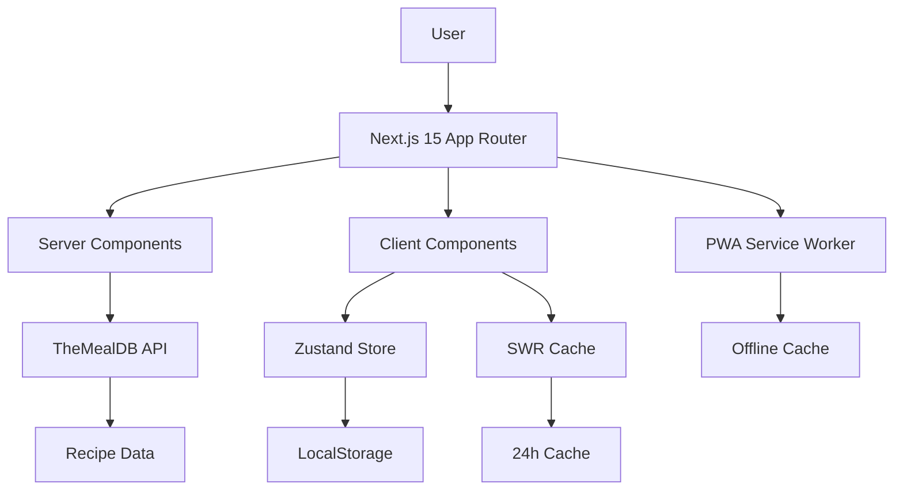

# Design Document

## Overview

The Next.js 15 App Router Rebuild transforms the Global Authentic Recipes platform into a modern, production-ready application using Next.js 15 App Router architecture. The system leverages TheMealDB's free API, implements professional design standards, and delivers exceptional performance with Lighthouse scores of 95+. The architecture prioritizes mobile-first design, accessibility, and PWA capabilities for Indian users.

## Architecture

### System Architecture



### Technology Stack

- **Frontend Framework**: Next.js 15 with App Router
- **Language**: TypeScript
- **Styling**: Tailwind CSS + shadcn/ui components
- **State Management**: Zustand
- **Data Fetching**: SWR with 24-hour caching
- **Animations**: Framer Motion
- **Icons**: Lucide React
- **PWA**: next-pwa
- **Deployment**: Vercel (zero-config)

### File Structure

```
app/
├── layout.tsx                 # Root layout with theme provider
├── page.tsx                   # Homepage with hero carousel
├── globals.css                # Tailwind + custom styles
├── recipes/
│   ├── page.tsx              # Recipe list with infinite scroll
│   ├── [id]/
│   │   └── page.tsx          # Recipe detail page
│   └── loading.tsx           # Loading UI
├── favorites/
│   └── page.tsx              # Saved recipes page
├── api/
│   └── og/
│       └── route.ts          # Open Graph image generation
components/
├── ui/                       # shadcn/ui components
│   ├── button.tsx
│   ├── card.tsx
│   ├── modal.tsx
│   └── ...
├── RecipeCard.tsx            # Recipe card component
├── RecipeCarousel.tsx        # Hero carousel
├── Filters.tsx               # Sidebar filters
├── CookingTimer.tsx          # Multi-timer component
├── ShoppingList.tsx          # Shopping list generator
├── ServingScaler.tsx         # Serving size adjuster
├── SearchBar.tsx             # Search with autocomplete
├── Navbar.tsx                # Navigation component
└── Footer.tsx                # Footer component
lib/
├── api.ts                    # TheMealDB API wrapper
├── schema.ts                 # JSON-LD schema generation
├── utils.ts                  # Utility functions
└── constants.ts              # App constants
hooks/
├── useRecipes.ts             # SWR recipe hooks
├── useFavorites.ts           # Favorites management
├── useTimer.ts               # Cooking timer logic
└── useLocalStorage.ts        # LocalStorage utilities
store/
├── favorites.ts              # Zustand favorites store
├── ui.ts                     # UI state store
└── cart.ts                   # Shopping cart store
types/
├── recipe.ts                 # Recipe type definitions
├── api.ts                    # API response types
└── index.ts                  # Exported types
```

## Components and Interfaces

### Core Components

#### RecipeCard Component
```typescript
interface RecipeCardProps {
  recipe: Recipe;
  variant?: 'default' | 'compact' | 'featured';
  showFavorite?: boolean;
  showTimer?: boolean;
}
```

#### CookingTimer Component
```typescript
interface CookingTimerProps {
  steps: RecipeStep[];
  onStepComplete?: (stepIndex: number) => void;
  onTimerComplete?: () => void;
}
```

#### Filters Component
```typescript
interface FiltersProps {
  cuisines: string[];
  selectedCuisine?: string;
  selectedDiet?: string;
  maxTime?: number;
  onFilterChange: (filters: FilterState) => void;
}
```

### API Integration Layer

#### TheMealDB API Wrapper
```typescript
export const mealAPI = {
  // Get random recipes for hero carousel
  getRandomRecipes: async (count: number = 3): Promise<Recipe[]> => {
    const promises = Array(count).fill(null).map(() => 
      fetch('https://www.themealdb.com/api/json/v1/1/random.php')
        .then(res => res.json())
        .then(data => transformMealToRecipe(data.meals[0]))
    );
    return Promise.all(promises);
  },

  // Search recipes by name
  searchRecipes: async (query: string): Promise<Recipe[]> => {
    const response = await fetch(
      `https://www.themealdb.com/api/json/v1/1/search.php?s=${encodeURIComponent(query)}`
    );
    const data = await response.json();
    return data.meals?.map(transformMealToRecipe) || [];
  },

  // Filter by cuisine/area
  getRecipesByArea: async (area: string): Promise<Recipe[]> => {
    const response = await fetch(
      `https://www.themealdb.com/api/json/v1/1/filter.php?a=${area}`
    );
    const data = await response.json();
    return data.meals?.map(transformMealToRecipe) || [];
  },

  // Get recipe details
  getRecipeById: async (id: string): Promise<Recipe | null> => {
    const response = await fetch(
      `https://www.themealdb.com/api/json/v1/1/lookup.php?i=${id}`
    );
    const data = await response.json();
    return data.meals?.[0] ? transformMealToRecipe(data.meals[0]) : null;
  },

  // Get all available cuisines
  getAllCuisines: async (): Promise<string[]> => {
    const response = await fetch(
      'https://www.themealdb.com/api/json/v1/1/list.php?a=list'
    );
    const data = await response.json();
    return data.meals?.map((item: any) => item.strArea) || [];
  }
};
```

## Data Models

### Recipe Type Definition
```typescript
interface Recipe {
  id: string;
  name: string;
  image: string;
  category: string;
  area: string;
  instructions: string;
  ingredients: Ingredient[];
  tags: string[];
  youtubeUrl?: string;
  sourceUrl?: string;
  servings: number;
  prepTime?: number;
  cookTime?: number;
  difficulty?: 'Easy' | 'Medium' | 'Hard';
}

interface Ingredient {
  name: string;
  measure: string;
  image?: string;
}

interface RecipeStep {
  id: string;
  instruction: string;
  duration?: number; // in minutes
  temperature?: string;
  equipment?: string[];
}
```

### State Management Types
```typescript
interface FavoritesState {
  favorites: Recipe[];
  addFavorite: (recipe: Recipe) => void;
  removeFavorite: (recipeId: string) => void;
  isFavorite: (recipeId: string) => boolean;
  clearFavorites: () => void;
}

interface UIState {
  theme: 'light' | 'dark';
  sidebarOpen: boolean;
  searchQuery: string;
  filters: FilterState;
  toggleTheme: () => void;
  setSidebarOpen: (open: boolean) => void;
  setSearchQuery: (query: string) => void;
  setFilters: (filters: FilterState) => void;
}
```

## Correctness Properties

*A property is a characteristic or behavior that should hold true across all valid executions of a system—essentially, a formal statement about what the system should do. Properties serve as the bridge between human-readable specifications and machine-verifiable correctness guarantees.*

### Property 1: API Response Transformation Consistency
*For any* valid TheMealDB API response, transforming it to our Recipe type and back should preserve all essential recipe information without data loss.
**Validates: Requirements 2.1, 2.2, 2.3, 2.4, 2.5**

### Property 2: Favorites State Persistence
*For any* recipe added to favorites, the recipe should persist across browser sessions and remain accessible until explicitly removed by the user.
**Validates: Requirements 4.8, 8.5**

### Property 3: Serving Size Scaling Accuracy
*For any* recipe with valid ingredient measurements, scaling servings up or down should proportionally adjust all ingredient quantities while maintaining measurement unit consistency.
**Validates: Requirements 4.7, 12.3**

### Property 4: Search Result Relevance
*For any* search query, all returned results should contain the search term in either the recipe name, ingredients, or category, ensuring search accuracy.
**Validates: Requirements 13.1, 13.4**

### Property 5: Responsive Layout Integrity
*For any* screen size from 320px to 2560px width, all UI components should remain accessible, readable, and functional without horizontal scrolling or content overflow.
**Validates: Requirements 5.1, 5.2, 5.3, 5.6**

### Property 6: Performance Budget Compliance
*For any* page load, the application should achieve Lighthouse Performance score of 95+ with Core Web Vitals within acceptable thresholds.
**Validates: Requirements 6.1, 6.2, 6.3, 6.4**

### Property 7: Accessibility Standards Compliance
*For any* interactive element, it should be keyboard accessible, have proper ARIA labels, and maintain sufficient color contrast ratios.
**Validates: Requirements 9.1, 9.2, 9.3**

### Property 8: PWA Installation Capability
*For any* supported browser and device, the application should be installable as a PWA and function offline with cached content.
**Validates: Requirements 7.1, 7.2, 7.3**

### Property 9: API Fallback Reliability
*For any* TheMealDB API failure scenario, the application should gracefully fallback to static recipes and display appropriate error messages.
**Validates: Requirements 2.7, 14.1, 14.2, 14.4**

### Property 10: Timer Functionality Accuracy
*For any* cooking step with a specified duration, the timer should count down accurately and trigger notifications at completion.
**Validates: Requirements 12.1, 12.4**

### Property 11: Shopping List Generation Completeness
*For any* recipe, the generated shopping list should include all ingredients with correct quantities and measurements.
**Validates: Requirements 12.2, 12.3**

### Property 12: Theme Consistency
*For any* theme (light/dark), all components should use consistent colors, maintain proper contrast ratios, and persist user preferences.
**Validates: Requirements 3.6, 8.5**

### Property 13: SEO Metadata Completeness
*For any* recipe page, it should include complete Schema.org Recipe markup, Open Graph tags, and proper meta descriptions.
**Validates: Requirements 6.5, 6.6, 6.7**

### Property 14: Infinite Scroll Performance
*For any* recipe list with infinite scroll, loading additional items should not degrade performance or cause memory leaks.
**Validates: Requirements 4.3, 6.1**

### Property 15: Error Boundary Coverage
*For any* component error or API failure, the application should display user-friendly error messages and provide recovery options.
**Validates: Requirements 11.5, 14.3, 14.4**

## Error Handling

### API Error Handling Strategy
- **Network Failures**: Retry with exponential backoff, fallback to cached data
- **Invalid Responses**: Validate data structure, use default values for missing fields
- **Rate Limiting**: Implement request queuing and user feedback
- **Timeout Handling**: Set reasonable timeouts, provide cancel options

### User Experience Error Handling
- **Loading States**: Skeleton screens and progress indicators
- **Empty States**: Helpful messages with suggested actions
- **Error Boundaries**: Graceful component failure recovery
- **Offline Support**: Clear offline indicators and cached content access

## Testing Strategy

### Unit Testing
- Component rendering and prop handling
- Utility function correctness
- State management logic
- API response transformation

### Integration Testing
- API integration with TheMealDB
- State persistence and retrieval
- User interaction flows
- PWA functionality

### Property-Based Testing
- Recipe data transformation consistency
- Responsive design across screen sizes
- Performance characteristics
- Accessibility compliance

### End-to-End Testing
- Complete user journeys
- Cross-browser compatibility
- Mobile device testing
- Performance benchmarking

Each property test should run minimum 100 iterations and be tagged with:
**Feature: nextjs15-app-router-rebuild, Property {number}: {property_text}**