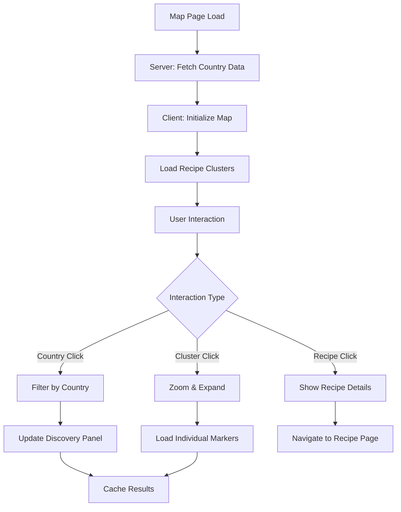
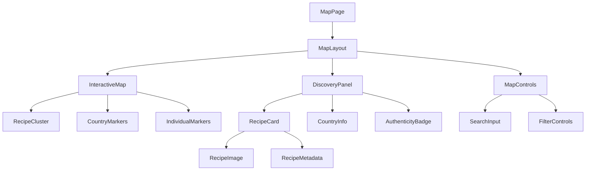

# Design Document: Recipe Map View

## Overview

The Recipe Map View feature transforms recipe discovery from traditional list-based browsing into an interactive geographic exploration experience. This design creates an educational, culturally-aware interface that allows users to discover authentic recipes by their geographic origins, improving engagement, discoverability, and SEO performance.

The design leverages Next.js App Router for optimal SEO with static country pages, integrates with modern mapping providers (Mapbox/Google Maps) for smooth interactions, and implements intelligent clustering for performance at scale. The interface balances educational content with intuitive navigation, making culinary exploration both informative and engaging.

## Architecture

### Route Structure

```
/map/
├── page.tsx                    # Main interactive map page
├── layout.tsx                  # Map-specific layout with SEO optimization
├── [country]/
│   ├── page.tsx               # Static country pages for SEO
│   └── loading.tsx            # Loading states for country pages
└── components/
    ├── InteractiveMap.tsx     # Main map component
    ├── RecipeCluster.tsx      # Marker clustering logic
    ├── DiscoveryPanel.tsx     # Recipe display panel
    ├── CountryInfo.tsx        # Cultural context component
    ├── AuthenticityBadge.tsx  # Trust indicators
    └── MapControls.tsx        # Search and filter controls
```

### Data Flow Architecture



### Component Hierarchy



## Components and Interfaces

### Core Data Interfaces

```typescript
interface GeographicRecipe {
  id: string;
  slug: string;
  title: string;
  description: string;
  image: string;
  coordinates: {
    latitude: number;
    longitude: number;
  };
  location: {
    country: string;
    region?: string;
    countryCode: string;
  };
  authenticity: {
    status: 'verified' | 'community' | 'ai-generated';
    culturalOrigin: string;
    verificationDate?: Date;
  };
  metadata: {
    prepTime: number;
    difficulty: 'easy' | 'medium' | 'hard';
    cuisine: string;
  };
}

interface RecipeCluster {
  id: string;
  coordinates: {
    latitude: number;
    longitude: number;
  };
  recipeCount: number;
  recipes: GeographicRecipe[];
  bounds: {
    north: number;
    south: number;
    east: number;
    west: number;
  };
}

interface CountryData {
  code: string;
  name: string;
  coordinates: {
    latitude: number;
    longitude: number;
  };
  recipeCount: number;
  cuisineTypes: string[];
  culturalContext: {
    description: string;
    signatureDishes: string[];
    cookingTraditions: string[];
  };
}

interface MapState {
  center: {
    latitude: number;
    longitude: number;
  };
  zoom: number;
  selectedCountry?: string;
  selectedCluster?: string;
  filters: {
    cuisine?: string;
    difficulty?: string;
    authenticity?: string;
    searchQuery?: string;
  };
}
```

### InteractiveMap Component

**Purpose**: Core map interface with clustering and interaction handling
**Key Features**:
- Provider-agnostic map integration (Mapbox/Google Maps)
- Intelligent marker clustering based on zoom level
- Smooth zoom and pan animations
- Touch-optimized interactions for mobile

```typescript
interface InteractiveMapProps {
  initialRecipes: GeographicRecipe[];
  countries: CountryData[];
  onCountrySelect: (country: string) => void;
  onClusterSelect: (cluster: RecipeCluster) => void;
  onRecipeSelect: (recipe: GeographicRecipe) => void;
  mapState: MapState;
  onMapStateChange: (state: MapState) => void;
}
```

### RecipeCluster Component

**Purpose**: Manages marker clustering logic and visual representation
**Key Features**:
- Dynamic clustering based on zoom level and density
- Visual distinction between single recipes and clusters
- Smooth cluster expansion and contraction
- Performance optimization for thousands of markers

```typescript
interface RecipeClusterProps {
  recipes: GeographicRecipe[];
  zoom: number;
  bounds: MapBounds;
  onClusterClick: (cluster: RecipeCluster) => void;
  onRecipeClick: (recipe: GeographicRecipe) => void;
}
```

### DiscoveryPanel Component

**Purpose**: Displays filtered recipes and cultural context
**Key Features**:
- Responsive layout (side panel on desktop, bottom sheet on mobile)
- Recipe cards with images, metadata, and authenticity badges
- Cultural context and educational content
- Smooth animations and loading states

```typescript
interface DiscoveryPanelProps {
  selectedCountry?: CountryData;
  recipes: GeographicRecipe[];
  isLoading: boolean;
  onRecipeSelect: (recipe: GeographicRecipe) => void;
  onClose: () => void;
}
```

### CountryInfo Component

**Purpose**: Educational content about culinary cultures and regions
**Key Features**:
- Cultural context and cooking traditions
- Signature dishes and regional specialties
- Historical background and culinary influences
- Links to related content and recipe collections

```typescript
interface CountryInfoProps {
  country: CountryData;
  recipeCount: number;
  featuredRecipes: GeographicRecipe[];
}
```

## Data Models

### Database Schema Extensions

```sql
-- Geographic data extension for recipes table
ALTER TABLE recipes ADD COLUMN latitude DECIMAL(10, 8);
ALTER TABLE recipes ADD COLUMN longitude DECIMAL(11, 8);
ALTER TABLE recipes ADD COLUMN country VARCHAR(100);
ALTER TABLE recipes ADD COLUMN country_code CHAR(2);
ALTER TABLE recipes ADD COLUMN region VARCHAR(100);

-- Indexes for geographic queries
CREATE INDEX idx_recipes_coordinates ON recipes(latitude, longitude);
CREATE INDEX idx_recipes_country ON recipes(country);
CREATE INDEX idx_recipes_country_code ON recipes(country_code);

-- Country metadata table
CREATE TABLE countries (
  code CHAR(2) PRIMARY KEY,
  name VARCHAR(100) NOT NULL,
  latitude DECIMAL(10, 8) NOT NULL,
  longitude DECIMAL(11, 8) NOT NULL,
  description TEXT,
  cuisine_types JSON,
  cultural_context JSON,
  created_at TIMESTAMP DEFAULT CURRENT_TIMESTAMP,
  updated_at TIMESTAMP DEFAULT CURRENT_TIMESTAMP ON UPDATE CURRENT_TIMESTAMP
);

-- Regional dishes support (many-to-many)
CREATE TABLE recipe_locations (
  id INT AUTO_INCREMENT PRIMARY KEY,
  recipe_id INT NOT NULL,
  latitude DECIMAL(10, 8) NOT NULL,
  longitude DECIMAL(11, 8) NOT NULL,
  location_type ENUM('origin', 'regional_variant', 'cultural_influence'),
  FOREIGN KEY (recipe_id) REFERENCES recipes(id) ON DELETE CASCADE
);
```

### Coordinate Strategy

**Exact Coordinates vs Country-Level**:
- **Exact Coordinates**: Use for recipes with specific regional origins (e.g., Neapolitan Pizza)
- **Country-Level**: Use for national dishes or when exact origin is unknown
- **Multiple Coordinates**: Use recipe_locations table for dishes with regional variants

**Fallback Strategy**:
1. Use exact coordinates if available
2. Fall back to region center coordinates
3. Fall back to country center coordinates
4. Use cuisine-type geographic center as last resort

### Caching Strategy

```typescript
interface CacheStrategy {
  countryData: {
    ttl: '24h';
    key: 'country:{countryCode}';
    invalidation: 'recipe_update';
  };
  recipeClusters: {
    ttl: '1h';
    key: 'clusters:{zoom}:{bounds}';
    invalidation: 'recipe_create|recipe_update';
  };
  searchResults: {
    ttl: '30m';
    key: 'search:{query}:{filters}';
    invalidation: 'recipe_update';
  };
}
```

## Correctness Properties

*A property is a characteristic or behavior that should hold true across all valid executions of a system—essentially, a formal statement about what the system should do. Properties serve as the bridge between human-readable specifications and machine-verifiable correctness guarantees.*

Let me analyze the acceptance criteria to determine which ones can be tested as properties:
### Property 1: Geographic Data Integrity
*For any* recipe in the system, geographic data should be complete with valid coordinates, country information, and appropriate fallback to country-level coordinates when exact locations are unavailable.
**Validates: Requirements 1.1, 1.2, 1.3, 1.6**

### Property 2: Map Initialization and Rendering
*For any* map page load, the system should display an interactive world map with country-level recipe clusters initially, using server-side rendering for SEO optimization.
**Validates: Requirements 2.1, 2.2, 2.3, 3.1, 4.1**

### Property 3: Marker Clustering and Visual Distinction
*For any* geographic area with multiple recipes, the system should cluster nearby markers appropriately and visually distinguish between single recipes and clusters, maintaining performance with large datasets.
**Validates: Requirements 3.2, 3.5, 7.2, 7.4**

### Property 4: Interactive Map Navigation
*For any* user interaction with map elements (countries, clusters, recipes), the system should respond appropriately by filtering, zooming, or displaying details while maintaining map state.
**Validates: Requirements 3.3, 3.4, 3.6, 4.2, 4.4, 4.5, 4.6**

### Property 5: Discovery Panel Content Display
*For any* selected geographic region or recipe collection, the discovery panel should display complete recipe information including images, names, regions, and authenticity badges.
**Validates: Requirements 4.3**

### Property 6: SEO Optimization and Static Content
*For any* country with recipes, the system should generate static pages with complete SEO metadata, structured data markup, and server-rendered content for search engine crawling.
**Validates: Requirements 5.1, 5.2, 5.3, 5.4, 5.5, 5.6**

### Property 7: Accessibility Compliance
*For any* map interface element, the system should provide keyboard navigation, ARIA labels, screen reader support, appropriate touch targets, and color contrast standards.
**Validates: Requirements 6.1, 6.2, 6.3, 6.4, 6.5, 6.6**

### Property 8: Performance Optimization
*For any* map interaction or data loading operation, the system should implement lazy loading, caching, and progressive enhancement to maintain smooth performance.
**Validates: Requirements 7.1, 7.3, 7.5, 7.6**

### Property 9: Authenticity Indicator Display
*For any* recipe displayed on the map or in panels, authenticity indicators should be visible but non-intrusive, with appropriate aggregation for clusters and clear labeling for AI-generated content.
**Validates: Requirements 8.1, 8.2, 8.3, 8.4, 8.5**

### Property 10: Cultural and Educational Context
*For any* geographic region or country, the system should provide cultural context, signature dishes, cooking traditions, and links to related content when available.
**Validates: Requirements 9.1, 9.2, 9.3, 9.4, 9.5**

### Property 11: Mobile Touch Optimization
*For any* mobile device interaction, the system should optimize touch gestures, adapt layouts appropriately, and ensure all elements are touch-friendly with adequate spacing.
**Validates: Requirements 10.1, 10.2, 10.3, 10.4, 10.5**

### Property 12: Search and Filter Integration
*For any* search query or filter application, the system should update both map markers and discovery panel content while maintaining filter state during navigation.
**Validates: Requirements 11.1, 11.2, 11.3, 11.4, 11.5**

### Property 13: Analytics and Engagement Tracking
*For any* user interaction with the map feature, the system should track engagement metrics, discovery rates, regional interest, and authenticity preferences for optimization purposes.
**Validates: Requirements 12.1, 12.2, 12.3, 12.4, 12.5**

## Error Handling

### Geographic Data Errors
- **Missing Coordinates**: Fall back to country-level coordinates, then cuisine-type geographic center
- **Invalid Coordinates**: Validate latitude (-90 to 90) and longitude (-180 to 180) ranges
- **Country Mismatch**: Cross-validate coordinates with country boundaries
- **Clustering Failures**: Gracefully degrade to individual markers when clustering fails

### Map Provider Errors
- **API Failures**: Provide static fallback map with basic functionality
- **Network Issues**: Cache map tiles and essential data for offline functionality
- **Rate Limiting**: Implement exponential backoff and request queuing
- **Browser Compatibility**: Detect unsupported features and provide alternatives

### User Interaction Errors
- **Invalid Selections**: Prevent selection of empty regions or invalid coordinates
- **Performance Degradation**: Implement progressive loading and marker limits
- **Touch Conflicts**: Handle gesture conflicts between map and panel interactions
- **State Corruption**: Validate and sanitize map state before updates

### SEO and Content Errors
- **Missing Country Data**: Generate basic pages with available recipe information
- **Structured Data Validation**: Ensure schema markup passes validation tools
- **Broken Links**: Implement link checking and automatic redirect handling
- **Content Gaps**: Provide fallback content when cultural context is unavailable

## Testing Strategy

### Dual Testing Approach

The Recipe Map View feature requires both unit testing and property-based testing to ensure comprehensive coverage:

**Unit Tests** focus on:
- Specific user interactions (map clicks, panel selections, filter applications)
- Edge cases (empty countries, single recipes, boundary coordinates)
- Integration points between map provider and application logic
- SEO metadata generation and structured data validation
- Accessibility compliance with assistive technology simulation

**Property-Based Tests** focus on:
- Universal behaviors across all geographic regions and recipe collections
- Map state management consistency during navigation and filtering
- Clustering algorithm correctness across varying data densities
- Performance characteristics under different load conditions
- Data integrity across coordinate systems and fallback scenarios

### Property-Based Testing Configuration

- **Testing Library**: Fast-check for TypeScript/JavaScript property-based testing
- **Test Iterations**: Minimum 100 iterations per property test
- **Test Tagging**: Each property test tagged with format: **Feature: recipe-map, Property {number}: {property_text}**
- **Generator Strategy**: Smart generators that create realistic geographic data, recipe collections, and user interaction patterns

### Testing Implementation Requirements

Each correctness property must be implemented as a single property-based test that:
1. Generates appropriate test data (coordinates, countries, recipes, user actions)
2. Executes the system behavior being tested
3. Verifies the expected property holds true
4. References the specific design document property it validates

Unit tests complement property tests by:
1. Testing specific examples that demonstrate correct geographic behavior
2. Verifying integration between map components and existing recipe system
3. Validating SEO features with search engine simulation
4. Testing accessibility features with screen reader and keyboard simulation

### Performance Testing Considerations

- **Map Rendering**: Measure initial load time and interaction responsiveness
- **Clustering Performance**: Test clustering algorithms with varying data sizes
- **Memory Usage**: Monitor memory consumption with large marker sets
- **Network Efficiency**: Test caching effectiveness and data transfer optimization

## Implementation Notes

### Next.js App Router Integration

- **Server Components**: Country page generation and initial recipe data fetching
- **Client Components**: Interactive map interface with real-time state management
- **Static Generation**: Pre-built country pages for SEO optimization
- **Route Handlers**: API endpoints for geographic queries and filtering
- **Metadata API**: Dynamic SEO metadata generation for country pages

### Map Provider Integration Strategy

**Provider-Agnostic Design**:
```typescript
interface MapProvider {
  initialize(container: HTMLElement, options: MapOptions): Promise<MapInstance>;
  addMarkers(markers: MarkerData[]): void;
  addClusters(clusters: ClusterData[]): void;
  setView(center: Coordinates, zoom: number): void;
  onInteraction(callback: InteractionCallback): void;
}

// Implementations for different providers
class MapboxProvider implements MapProvider { /* ... */ }
class GoogleMapsProvider implements MapProvider { /* ... */ }
```

**Clustering Strategy**:
- Use Supercluster library for consistent clustering across providers
- Implement zoom-based clustering thresholds (country → region → city → individual)
- Cache cluster calculations for performance
- Smooth cluster transitions during zoom operations

### SEO Architecture

**Static Page Generation**:
```typescript
// Generate static paths for all countries with recipes
export async function generateStaticParams() {
  const countries = await getCountriesWithRecipes();
  return countries.map(country => ({
    country: country.code.toLowerCase()
  }));
}

// Generate metadata for each country page
export async function generateMetadata({ params }): Promise<Metadata> {
  const country = await getCountryData(params.country);
  return {
    title: `${country.name} Recipes - Authentic Culinary Map`,
    description: `Discover authentic recipes from ${country.name}. Explore traditional dishes, cooking techniques, and cultural food stories.`,
    keywords: `${country.name} recipes, ${country.cuisineTypes.join(', ')}, authentic cooking`,
    openGraph: {
      title: `Authentic ${country.name} Recipes`,
      description: `Explore traditional recipes and culinary culture from ${country.name}`,
      images: [`/images/countries/${country.code.toLowerCase()}.jpg`]
    }
  };
}
```

**Structured Data Implementation**:
```typescript
// Place schema for country pages
const placeSchema = {
  "@context": "https://schema.org",
  "@type": "Place",
  "name": country.name,
  "geo": {
    "@type": "GeoCoordinates",
    "latitude": country.coordinates.latitude,
    "longitude": country.coordinates.longitude
  },
  "description": country.culturalContext.description
};

// Recipe collection schema
const recipeCollectionSchema = {
  "@context": "https://schema.org",
  "@type": "ItemList",
  "name": `${country.name} Traditional Recipes`,
  "numberOfItems": country.recipeCount,
  "itemListElement": recipes.map((recipe, index) => ({
    "@type": "Recipe",
    "position": index + 1,
    "name": recipe.title,
    "url": `/recipes/${recipe.slug}`
  }))
};
```

### Performance Optimization

**Lazy Loading Strategy**:
```typescript
// Lazy load map component
const InteractiveMap = dynamic(() => import('./InteractiveMap'), {
  loading: () => <MapSkeleton />,
  ssr: false
});

// Progressive recipe loading
const useProgressiveRecipes = (bounds: MapBounds, zoom: number) => {
  const [recipes, setRecipes] = useState<GeographicRecipe[]>([]);
  
  useEffect(() => {
    const loadRecipes = async () => {
      const newRecipes = await fetchRecipesInBounds(bounds, zoom);
      setRecipes(prev => [...prev, ...newRecipes]);
    };
    
    loadRecipes();
  }, [bounds, zoom]);
  
  return recipes;
};
```

**Caching Implementation**:
```typescript
// Redis caching for geographic queries
const cacheKey = `recipes:${country}:${zoom}:${bounds.toString()}`;
const cachedData = await redis.get(cacheKey);

if (cachedData) {
  return JSON.parse(cachedData);
}

const freshData = await queryRecipesByGeography(country, bounds);
await redis.setex(cacheKey, 3600, JSON.stringify(freshData)); // 1 hour TTL
return freshData;
```

### Accessibility Implementation

**Keyboard Navigation**:
```typescript
const handleKeyboardNavigation = (event: KeyboardEvent) => {
  switch (event.key) {
    case 'ArrowUp':
    case 'ArrowDown':
    case 'ArrowLeft':
    case 'ArrowRight':
      // Pan map in direction
      panMap(event.key);
      break;
    case '+':
    case '=':
      // Zoom in
      zoomIn();
      break;
    case '-':
      // Zoom out
      zoomOut();
      break;
    case 'Enter':
    case ' ':
      // Select focused element
      selectFocusedElement();
      break;
  }
};
```

**Screen Reader Support**:
```typescript
// ARIA live region for map updates
const announceMapChange = (message: string) => {
  const liveRegion = document.getElementById('map-announcements');
  if (liveRegion) {
    liveRegion.textContent = message;
  }
};

// Example usage
onCountrySelect((country) => {
  announceMapChange(`Selected ${country.name}. Showing ${country.recipeCount} recipes.`);
});
```

### Browser Compatibility

- **Core Features**: Support for all modern browsers (Chrome 90+, Firefox 88+, Safari 14+)
- **Map APIs**: Graceful degradation for older browsers with static fallback
- **Touch Events**: Universal touch support with pointer event fallbacks
- **Geolocation**: Optional user location features with permission handling