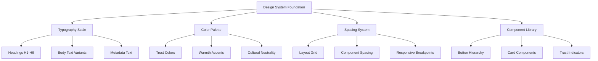
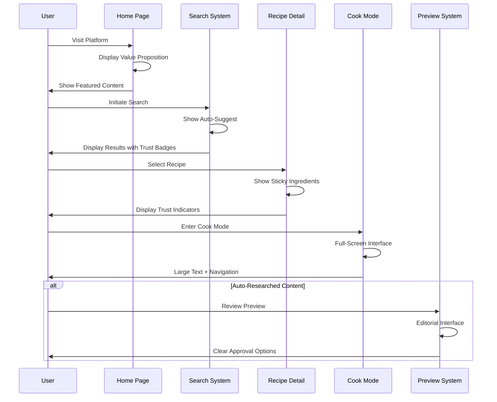

# Design Document

## Overview

The UI/UX Polish System transforms the functionally complete Global Authentic Recipes platform into a professional, consumer-ready product through systematic design improvements. The system implements a cohesive design language that builds trust, respects cultural authenticity, and optimizes for real-world cooking scenarios while maintaining accessibility and performance standards.

The design philosophy centers on "Cultural Respect Through Simplicity" - using clean, professional design patterns that let authentic recipes shine without appropriating or stereotyping cultural elements.

## Architecture

### Design System Architecture



### User Experience Flow Architecture



## Components and Interfaces

### 1. Design System Foundation

**Typography Scale**
- **Purpose**: Establish visual hierarchy and readability across all contexts
- **Implementation**: Tailwind-based type scale optimized for kitchen environments

```typescript
interface TypographyScale {
  display: 'text-5xl md:text-6xl font-bold'; // Hero headlines
  h1: 'text-4xl md:text-5xl font-bold';      // Page titles
  h2: 'text-3xl md:text-4xl font-semibold';  // Section headers
  h3: 'text-2xl md:text-3xl font-semibold';  // Subsection headers
  h4: 'text-xl md:text-2xl font-medium';     // Component titles
  body: 'text-base md:text-lg';              // Main content
  bodyLarge: 'text-lg md:text-xl';           // Emphasized content
  metadata: 'text-sm md:text-base text-gray-600'; // Secondary info
  caption: 'text-xs md:text-sm text-gray-500';    // Fine print
}
```

**Color Palette for Trust and Warmth**
- **Primary Trust**: Deep blue-gray (#1e293b) for headers and primary actions
- **Warmth Accent**: Warm orange (#ea580c) for CTAs and highlights
- **Cultural Neutral**: Soft earth tones (#78716c, #a8a29e) for backgrounds
- **Success/Verified**: Forest green (#166534) for authenticity badges
- **Warning/Pending**: Amber (#d97706) for review states
- **Error/Destructive**: Muted red (#dc2626) for destructive actions

**Spacing System**
- **Base Unit**: 4px (0.25rem) for consistent rhythm
- **Component Spacing**: 16px, 24px, 32px, 48px for layout consistency
- **Section Spacing**: 64px, 96px for page-level separation
- **Mobile Adjustments**: Reduced spacing (12px, 16px, 24px) for mobile contexts

### 2. Trust and Authenticity Components

**Authenticity Badge System**
```typescript
interface AuthenticityBadge {
  type: 'verified' | 'community' | 'ai-pending' | 'research-mode';
  label: string;
  description: string;
  color: string;
  icon: string;
}

const badges = {
  verified: {
    label: 'Verified Authentic',
    description: 'Reviewed by cultural experts',
    color: 'bg-green-100 text-green-800 border-green-200',
    icon: 'shield-check'
  },
  community: {
    label: 'Community Reviewed',
    description: 'Validated by community members',
    color: 'bg-blue-100 text-blue-800 border-blue-200',
    icon: 'users'
  },
  'ai-pending': {
    label: 'Pending Review',
    description: 'Auto-researched, awaiting verification',
    color: 'bg-amber-100 text-amber-800 border-amber-200',
    icon: 'clock'
  }
};
```

**Trust Indicator Components**
- **Source Attribution**: Discrete display of research sources
- **Verification History**: Accessible timeline of recipe validation
- **Cultural Context**: Educational styling for origin information
- **Expert Endorsements**: Highlighting when available

### 3. Page-Specific Design Patterns

**Home Page Value Architecture**
- **Hero Section**: Large, welcoming headline with cultural imagery
- **Featured Regions**: Card-based layout with authentic photography
- **Seasonal Highlights**: Rotating festival-based content
- **Entry Points**: Prominent search bar and map exploration CTA

**Recipe Browse Interface**
- **Filter Sidebar**: Collapsible on mobile, persistent on desktop
- **Sort Controls**: Dropdown with clear options (Relevance, Authenticity, Popularity)
- **Recipe Grid**: Responsive card layout with consistent spacing
- **Loading States**: Skeleton loaders maintaining grid structure

**Recipe Detail Layout**
```typescript
interface RecipeDetailLayout {
  header: {
    title: string;
    authenticity: AuthenticityBadge;
    origin: GeographicInfo;
    ratings: RatingDisplay;
  };
  content: {
    ingredients: StickyIngredientList;
    steps: NumberedStepList;
    story: CulturalContext;
    nutrition: NutritionalInfo;
  };
  actions: {
    cookMode: PrimaryCTA;
    save: SecondaryCTA;
    share: TertiaryCTA;
  };
  sidebar: {
    mapPreview: InteractiveMap;
    relatedRecipes: RecipeCarousel;
    reviews: ReviewSummary;
  };
}
```

### 4. Cook Mode Interface Design

**Full-Screen Cooking Interface**
- **Layout**: Single-column, distraction-free design
- **Typography**: Extra-large text (text-2xl md:text-3xl) for kitchen visibility
- **Navigation**: Large touch targets (min 44px) for easy interaction
- **Progress**: Clear step indicators with completion states
- **Controls**: Prominent timer integration and step navigation

**One-Hand Operation Patterns**
- **Thumb-Friendly Zones**: Critical controls within thumb reach
- **Swipe Navigation**: Gesture-based step progression
- **Voice Commands**: Integration points for hands-free operation
- **Emergency Exit**: Always-accessible return to recipe view

### 5. Search Experience Design

**Search Interface Components**
```typescript
interface SearchExperience {
  searchBar: {
    placement: 'prominent-header' | 'hero-section';
    autoComplete: AutoSuggestDropdown;
    visualSuggestions: ImageThumbnails;
    trustBadges: AuthenticityIndicators;
  };
  resultStates: {
    loading: SkeletonGrid;
    found: RecipeGrid;
    researching: ResearchProgress;
    preview: PreviewInterface;
  };
  transitions: {
    stateChanges: SmoothAnimations;
    loadingIndicators: ProgressFeedback;
    errorStates: GracefulFallbacks;
  };
}
```

**Research Mode Communication**
- **Progress Indicators**: Clear messaging about AI research status
- **Source Transparency**: Discrete display of research sources
- **Time Estimates**: Realistic expectations for research completion
- **Cancellation Options**: User control over research process

### 6. Preview and Approval Interface

**Editorial Review Design**
- **Clear Separation**: Visual distinction between preview and published content
- **Editable Highlights**: Clear indication of modifiable fields
- **Source References**: Collapsible, non-intrusive source display
- **Action Hierarchy**: Primary (Save), Secondary (Edit), Tertiary (Discard)

**Disclaimer and Trust Building**
```typescript
interface PreviewInterface {
  header: {
    status: 'Auto-researched Content - Pending Review';
    disclaimer: NonAlarmingWarning;
    trustMessage: EducationalContext;
  };
  content: {
    editableFields: HighlightedSections;
    sourceReferences: CollapsiblePanel;
    culturalContext: EducationalSidebar;
  };
  actions: {
    primary: SaveToWebsiteButton;
    secondary: EditBeforeSavingButton;
    tertiary: DiscardButton;
  };
}
```

### 7. Mobile-First and Accessibility Design

**Mobile Optimization Patterns**
- **Touch Targets**: Minimum 44px for all interactive elements
- **Thumb Navigation**: Critical actions within thumb-friendly zones
- **Readable Text**: Minimum 16px base font size, scalable typography
- **Offline Indicators**: Clear messaging for connectivity issues

**Accessibility Implementation**
```typescript
interface AccessibilityFeatures {
  keyboard: {
    navigation: 'full-keyboard-support';
    focusIndicators: 'high-contrast-outlines';
    skipLinks: 'content-navigation-shortcuts';
  };
  screenReader: {
    labels: 'descriptive-aria-labels';
    landmarks: 'semantic-html-structure';
    announcements: 'live-region-updates';
  };
  visual: {
    contrast: 'wcag-aa-compliant';
    textScaling: 'responsive-typography';
    colorIndependence: 'icon-text-combinations';
  };
}
```

### 8. Performance and Loading States

**Skeleton Loading Strategy**
- **Recipe Cards**: Maintain card structure with content placeholders
- **Recipe Details**: Progressive loading of ingredients, then steps, then media
- **Search Results**: Grid-based skeletons matching final layout
- **Map Components**: Geographic outline loading before detailed data

**Progressive Enhancement Patterns**
- **Image Loading**: Blur-to-sharp transitions with proper aspect ratios
- **Map Loading**: Static geographic context before interactive features
- **Search Suggestions**: Immediate text suggestions, progressive image loading
- **Content Prioritization**: Critical cooking information loads first

## Data Models

### Design System Configuration

```typescript
interface DesignSystemConfig {
  typography: TypographyScale;
  colors: ColorPalette;
  spacing: SpacingSystem;
  breakpoints: ResponsiveBreakpoints;
  animations: AnimationTimings;
  accessibility: AccessibilitySettings;
}

interface ComponentLibrary {
  buttons: ButtonVariants;
  cards: CardComponents;
  badges: TrustIndicators;
  forms: InputComponents;
  navigation: NavigationPatterns;
  loading: LoadingStates;
}
```

### User Experience Metrics

```typescript
interface UXMetrics {
  perceivedPerformance: {
    skeletonLoadingTime: number;
    imageProgressiveLoading: boolean;
    transitionSmoothness: AnimationQuality;
  };
  accessibility: {
    keyboardNavigation: boolean;
    screenReaderCompatibility: boolean;
    colorContrastRatio: number;
  };
  mobileUsability: {
    touchTargetSize: number;
    oneHandOperation: boolean;
    offlineTolerance: boolean;
  };
  trustIndicators: {
    authenticityBadgeVisibility: boolean;
    sourceTransparency: boolean;
    culturalRespect: boolean;
  };
}
```

## Correctness Properties

*A property is a characteristic or behavior that should hold true across all valid executions of a system—essentially, a formal statement about what the system should do. Properties serve as the bridge between human-readable specifications and machine-verifiable correctness guarantees.*

### Property 1: Design System Consistency
*For any* page or component, the system should use consistent typography scales, spacing patterns, button hierarchies, and color applications across all contexts
**Validates: Requirements 1.1, 1.2, 1.3, 1.4, 1.5**

### Property 2: Home Page Value Communication
*For any* home page visit, the system should display a strong value proposition and provide clear entry points to search and map functionality
**Validates: Requirements 2.1, 2.4**

### Property 3: Featured Content Display
*For any* home page with available content, featured regions and seasonal recipes should be prominently displayed with proper visual hierarchy
**Validates: Requirements 2.2, 2.3**

### Property 4: Recipe Browse Functionality
*For any* recipe browsing session, the system should provide all required filters (cuisine, country, festival, difficulty) and sorting options (relevance, authenticity, popularity)
**Validates: Requirements 3.1, 3.2**

### Property 5: Loading State Consistency
*For any* loading operation, the system should display appropriate skeleton loaders, progressive image loading, and lazy loading for heavy components
**Validates: Requirements 3.3, 10.1, 10.2, 10.3**

### Property 6: Trust Indicator Display
*For any* recipe presentation, the system should show consistent authenticity badges and trust indicators appropriate to the recipe's verification status
**Validates: Requirements 3.4, 4.5, 11.1**

### Property 7: Recipe Detail Layout Structure
*For any* recipe detail page, the system should separate ingredients, steps, and cultural story into distinct sections with proper visual hierarchy
**Validates: Requirements 4.1**

### Property 8: Desktop Sticky Navigation
*For any* desktop viewport, recipe pages should provide sticky ingredient lists for easy reference during cooking
**Validates: Requirements 4.2**

### Property 9: Cook Mode CTA Prominence
*For any* recipe detail page, the system should display a prominent cook mode call-to-action button
**Validates: Requirements 4.3**

### Property 10: Geographic Context Integration
*For any* recipe with geographic data, the system should show map previews indicating cultural source
**Validates: Requirements 4.4**

### Property 11: Cook Mode Interface Optimization
*For any* cook mode session, the system should display full-screen interface with large readable text, intuitive navigation, and clear session controls
**Validates: Requirements 5.1, 5.2, 5.3, 5.5**

### Property 12: Timer Integration
*For any* cooking step with timing requirements, the system should integrate timer functionality within the cook mode interface
**Validates: Requirements 5.4**

### Property 13: Map Interaction Patterns
*For any* map usage, the system should provide intuitive interactions, side panels with recipe cards, and country-level exploration capabilities
**Validates: Requirements 6.1, 6.2, 6.3, 6.5**

### Property 14: Map Accessibility Fallbacks
*For any* map loading failure, the system should provide clear fallback list views for accessibility
**Validates: Requirements 6.4**

### Property 15: Search Experience Excellence
*For any* search interaction, the system should provide prominent placement, auto-suggest with images and badges, and smooth state transitions
**Validates: Requirements 7.1, 7.2, 7.3**

### Property 16: Research Communication Clarity
*For any* AI research operation, the system should display clear messaging about the research process and eliminate confusion between content types
**Validates: Requirements 7.4, 7.5**

### Property 17: Preview Mode Distinction
*For any* auto-researched content review, the system should clearly separate preview mode from published content with distinct visual styling
**Validates: Requirements 8.1**

### Property 18: Editorial Interface Clarity
*For any* preview interface, the system should highlight editable fields, display source references discreetly, and provide clear action CTAs
**Validates: Requirements 8.2, 8.3, 8.5**

### Property 19: Non-Alarming Status Communication
*For any* status messaging, the system should use strong but non-alarming disclaimer messaging appropriate to the context
**Validates: Requirements 8.4**

### Property 20: Accessibility Compliance
*For any* interactive element, the system should support keyboard navigation, provide screen-reader labels, maintain color contrast ratios, and use readable fonts
**Validates: Requirements 9.1, 9.2, 9.3, 9.5**

### Property 21: Mobile Touch Optimization
*For any* mobile interaction, the system should provide touch-friendly controls with appropriate target sizes for kitchen use
**Validates: Requirements 9.4**

### Property 22: Page Transition Smoothness
*For any* page navigation, the system should provide smooth transitions that enhance perceived performance
**Validates: Requirements 10.4**

### Property 23: Trust Education Integration
*For any* verification status display, the system should provide tooltips explaining verification meanings and style cultural information educationally
**Validates: Requirements 11.2, 11.3**

### Property 24: AI Branding Restraint
*For any* AI-related content, the system should avoid heavy AI branding that might undermine user trust
**Validates: Requirements 11.4**

### Property 25: Mobile-First Cooking Optimization
*For any* mobile device usage, the system should optimize interfaces for cooking scenarios with one-hand operation capabilities
**Validates: Requirements 12.1, 12.2**

### Property 26: Offline Content Tolerance
*For any* poor connectivity situation, the system should provide offline tolerance for basic content viewing
**Validates: Requirements 12.3**

### Property 27: Kitchen-Appropriate Interface Design
*For any* kitchen usage scenario, the system should provide clear tap targets and scroll-friendly layouts optimized for cooking environments
**Validates: Requirements 12.4, 12.5**

## Error Handling

### Visual Design Failures
- **Font Loading Errors**: Fallback to system fonts with maintained readability
- **Image Loading Failures**: Graceful placeholder display with retry mechanisms
- **Color Contrast Issues**: Automatic fallback to high-contrast alternatives
- **Layout Breaking**: Responsive design safeguards preventing content overflow

### Interactive Component Failures
- **Button State Errors**: Clear disabled states with user feedback
- **Form Validation Issues**: Inline error messaging with correction guidance
- **Navigation Failures**: Breadcrumb fallbacks and clear error communication
- **Search Functionality Errors**: Graceful degradation with basic search capabilities

### Performance Degradation Handling
- **Slow Loading States**: Extended skeleton loading with progress indicators
- **Memory Constraints**: Progressive content loading with cleanup mechanisms
- **Network Issues**: Offline mode activation with cached content access
- **Device Limitations**: Simplified interfaces for low-performance devices

### Accessibility Failures
- **Screen Reader Issues**: Alternative content access methods
- **Keyboard Navigation Problems**: Focus trap management and skip links
- **Color Blindness Accommodation**: Icon and text-based alternatives
- **Motor Impairment Support**: Extended interaction timeouts and larger targets

## Testing Strategy

### Dual Testing Approach

The system will implement both unit testing and property-based testing as complementary approaches:

**Unit Tests**: Focus on specific UI components, accessibility features, and user interaction scenarios including:
- Specific component rendering with correct styling classes
- Accessibility compliance for individual components (ARIA labels, keyboard navigation)
- Mobile touch target sizing and responsive behavior
- Loading state transitions and error handling scenarios

**Property-Based Tests**: Verify universal UI/UX properties across all components using fast-check library:
- Universal properties that hold for all page types, component states, and user interactions
- Comprehensive input coverage through randomization with minimum 100 iterations per test
- Each property test references its corresponding design document property
- Tag format: **Feature: ui-ux-polish, Property {number}: {property_text}**

### Visual Regression Testing

**Screenshot Comparison Strategy**:
- Automated visual regression testing for all major components
- Cross-browser compatibility testing (Chrome, Firefox, Safari, Edge)
- Responsive design validation across device sizes
- Dark mode and high contrast mode validation

**Accessibility Testing Integration**:
- Automated accessibility testing with axe-core
- Keyboard navigation flow testing
- Screen reader compatibility testing
- Color contrast ratio validation

### Performance Testing

**Loading Performance Validation**:
- Skeleton loading timing and visual accuracy
- Progressive image loading effectiveness
- Lazy loading trigger points and performance impact
- Page transition smoothness measurement

**Mobile Performance Testing**:
- Touch target size validation
- One-hand operation usability testing
- Offline functionality verification
- Battery usage optimization validation

### User Experience Testing

**Cooking Scenario Testing**:
- Kitchen environment usability testing
- One-hand operation validation
- Cook mode interface effectiveness
- Timer integration functionality

**Trust and Authenticity Testing**:
- Authenticity badge visibility and clarity
- Cultural respect validation in design choices
- Preview mode distinction effectiveness
- Source attribution clarity and discretion

The testing strategy ensures both functional correctness (unit tests) and universal design consistency (property tests) while maintaining cultural sensitivity and accessibility standards throughout the platform.

Now I need to use the prework tool to analyze the acceptance criteria before writing the correctness properties:

<function_calls>
<invoke name="prework">
<parameter name="featureName">ui-ux-polish